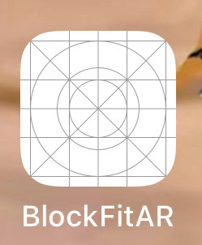
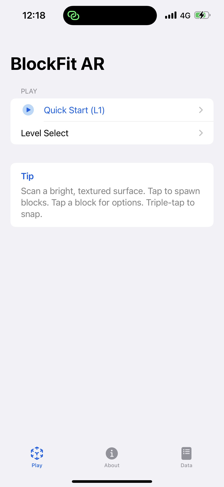
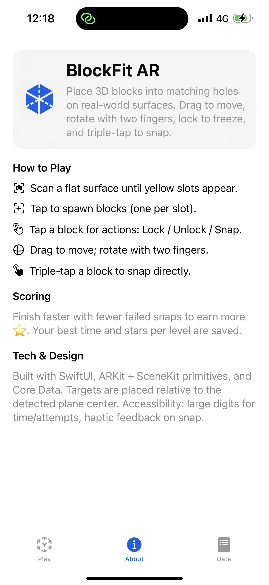
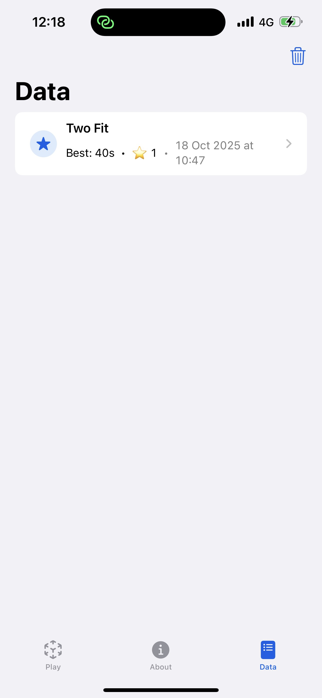
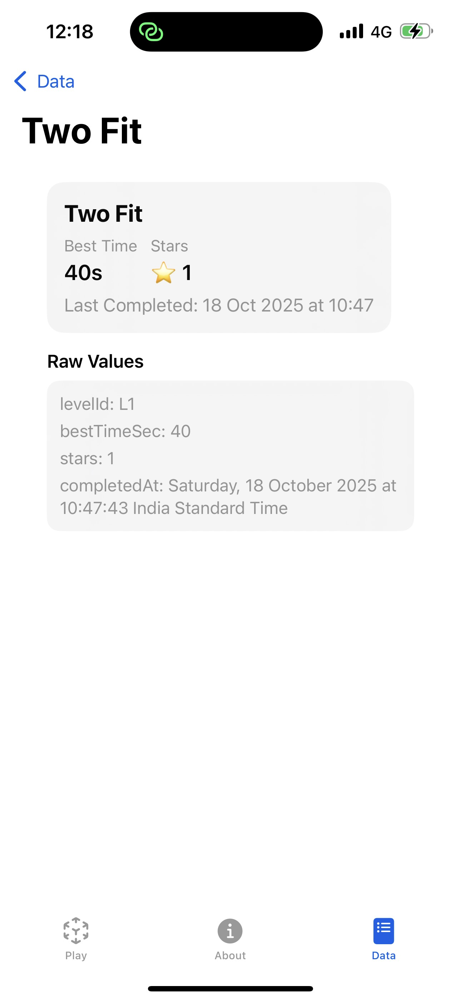
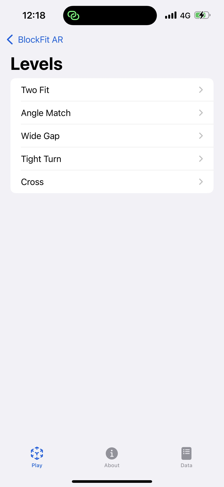
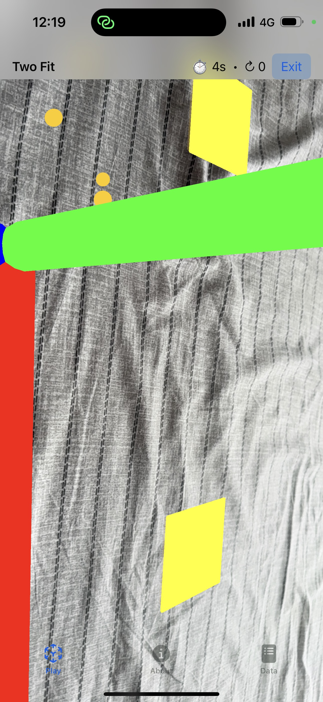
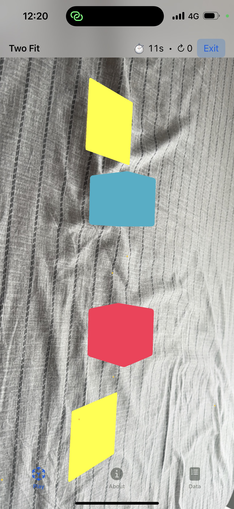

# BlockFit AR (iOS)
Augmented-reality puzzle where you place 3D blocks into matching “holes” on a real surface. Built with SwiftUI, ARKit + SceneKit, and Core Data. Blue-themed UI, simple game loop, five hand-crafted levels.

# ✨ Features
- AR Gameplay
    - Horizontal plane detection (desk/floor).
    - Two blocks per level; each snaps into its matching target.
    - **Tap** to spawn blocks, **drag** to move, **two-finger rotate** to turn.
    - **Block menu**: tap a block to Lock/Unlock or “Snap to Hole”.
    - **Triple-tap** a block to snap immediately (if close enough).
- Game Loop
    - Live timer and attempt counter.
    - Win banner with time + stars (1–3) based on performance.
    - Level complete state, ready for “Next level”/“Retry”.
- Levels (5)
    - L1: Two Fit (straightforward alignment)
    - L2: Angle Match (angled targets)
    - L3: Wide Gap (wider spacing, slight angles)
    - L4: Tight Turn (sharper rotations required)
    - L5: Cross (front/back placements)
- Persistence
    - Saves best time, stars, and last completed date per level.
    - Dedicated Data tab to browse stored **LevelProgress** entries + detail view.
- Polished UI
    - Cohesive blue theme, glass cards, legible HUD.
    - About page with how-to-play and tech notes.
- Haptics
    - Subtle feedback on actions; success haptic on snap.
>> No machine learning in this app (by design).

# 🎮 How to Play
1. Launch Play → Quick Start or choose a level in Level Select.
2. Move the device over a textured surface (desk, floor) until yellow slots appear.
3. Tap to spawn blocks (one per slot).
4. Tap a block for the menu (Lock/Unlock, Snap).
5. Drag to move on the plane; rotate with two fingers.
6. Fit both blocks into their slots → win banner with time & stars.

**Tips**
- Textured, well-lit surfaces detect faster.
- A small side-to-side motion helps plane detection lock in.
- Use Lock to keep your first fit from drifting while you adjust the second.

# 🧱 Architecture (high level)
- SwiftUI shell
    - **ContentView** with **Tabs**: Play / About / Data
    - **LevelSelectView** → launches **ARPuzzleView**
    - **AboutView, ProgressListView, ProgressDetailView**
- AR bridge
    - **ARPuzzleView** (HUD, timer, attempts, win state)
    - **ARPuzzleSceneView** (UIViewRepresentable wrapping ARSCNView)
        - Plane detection, gesture handling, target/blocks, snapping logic
- Game data
    - **Level.swift** → level definitions (IDs, target offsets/yaws, tolerances)
    - **DesignSystem.swift** → colors + simple components
- Persistence
    - **Persistence.swift** with Core Data container
    - **.xcdatamodeld** entity **LevelProgress**

# 🗃️ Data Model (Core Data)
**Entity: LevelProgress**
- **levelId: String** (e.g. “L1”)
- **bestTimeSec: Double** (lower is better)
- **stars: Int16** (0–3)
- **completedAt: Date?**

**Where it’s used**
- Save on level win if new time is better or stars are higher.
- Listed in Data tab and shown in detail view.

# 🛠️ Build & Run
**Requirements**
- Xcode 26 (or current), iOS 17+ target recommended
- Real iPhone/iPad with ARKit support (Simulator won’t do AR)

**Setup**
1. Open the project in Xcode.
2. In the target’s Signing & Capabilities, select your team.
3. In Info (Info.plist), ensure:
    - Privacy – Camera Usage Description = “Needed for AR gameplay.”
    - (Optional but nice) UIRequiredDeviceCapabilities includes arkit (prevents install on unsupported devices).
4. Build & run on a device.

**First run checklist**
- Allow camera permission.
- Scan a textured surface until slots appear.
- Tap to spawn, align blocks, and snap.

**Resetting data**
- Delete the app from device to clear the Core Data store, or use the Data tab’s “Clear” toolbar action (if present).

# 🧪 Tuning & Notes
- **Snap tolerances**: distance ≈ 2.5 cm, yaw ≈ 10–12°.
  Adjust in Level (default tolerances) or ARPuzzleSceneView if needed.
- **Visuals**: yellow target plates are intentionally obvious; tweak colors in makeTargetNode.
- **Performance**: we limit expensive operations and keep geometry simple (SceneKit primitives).

# 📁 Key Files
```bash
BlockFitARApp.swift – app entry, injects Core Data, global blue tint
ContentView.swift – Tabs and navigation
AboutView.swift – Instructions & tech notes
ProgressListView.swift / ProgressDetailView.swift – Persistence UI
ARPuzzleView.swift – HUD, timer, attempts, win banner
ARPuzzleSceneView.swift – ARKit/SceneKit bridge, gestures, snap logic
Level.swift – 5 demo levels + star calculation
DesignSystem.swift – brand blue and UI helpers
Persistence.swift – Core Data stack
```

🧭 Roadmap (nice-to-have)
- Progress badges in Level Select (best time + stars per level)
- Confetti/particles on win
- More block shapes (cylinders, L-pieces) with unique targets
- Accessibility voice hints (“Rotate slightly”, “Move closer”)

# 📜 License
>> Student/portfolio project. Use and modify freely for learning and demos. Credit appreciated. 
>> This project actually uses the MIT License but it is classified as a student Project for the MADD module 

# ChatGPT Usage
## Planning & scope
- Interpreted the assignment and confirmed ARKit + 3D interaction meets Part A.
- Shaped the game concept (block-into-hole) and set minimal, demo-able scope.
- Proposed a two-track plan: Part A (iOS AR puzzle) and Part B (tvOS reminder board).

## Technical guidance
- Advised on ARKit + SceneKit stack and available 3D primitives.
- Set up the UIViewRepresentable bridge (ARSCNView in SwiftUI).
- Listed Info.plist keys and device requirements (camera permission, AR-only on real device).

## Documentation
- Wrote a full README (features, build/run steps, architecture, data model, roadmap).
- Summarized how to play and first-run checklist for graders.

**Nice-to-have exploration (not shipped)**
- Discussed optional ML Assist paths (Core ML / Vision), but explicitly omitted from this app per your decision.


# Screenshots









